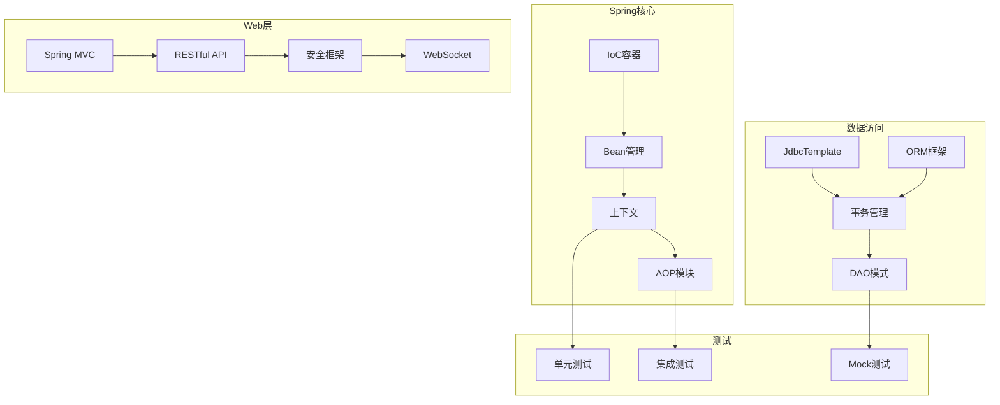

# 🎓 test-SpringProject - Spring项目测试


## 📖 项目简介

test-SpringProject是Spring框架的综合性测试项目,演示Spring核心功能,包括IoC容器、AOP、事务管理、数据访问、Web开发等模块。

## 🏗️ 系统架构



## 🚀 快速开始

```bash
# 克隆项目
git clone https://github.com/yourusername/test-SpringProject.git

# 运行项目
mvn spring-boot:run

# 运行测试
mvn test
```

## 💡 核心示例

### IoC容器

```java
@Configuration
@ComponentScan
public class AppConfig {
    
    @Bean
    public DataSource dataSource() {
        return DataSourceBuilder.create()
            .url("jdbc:mysql://localhost:3306/test")
            .username("root")
            .password("password")
            .build();
    }
    
    @Bean
    public JdbcTemplate jdbcTemplate(DataSource dataSource) {
        return new JdbcTemplate(dataSource);
    }
}
```

### AOP切面

```java
@Aspect
@Component
public class LoggingAspect {
    
    @Around("execution(* com.example.service.*.*(..))")
    public Object logMethod(ProceedingJoinPoint joinPoint) throws Throwable {
        String methodName = joinPoint.getSignature().getName();
        
        System.out.println("Before: " + methodName);
        Object result = joinPoint.proceed();
        System.out.println("After: " + methodName);
        
        return result;
    }
}
```

## 📝 更新日志

### v1.0.0 (2024-01-01)
- ✨ 初始版本发布
- ✨ 完成IoC容器测试
- ✨ 完成AOP切面测试
- ✨ 完成事务管理测试

---

⭐ 如果这个项目对你有帮助,欢迎Star支持!
