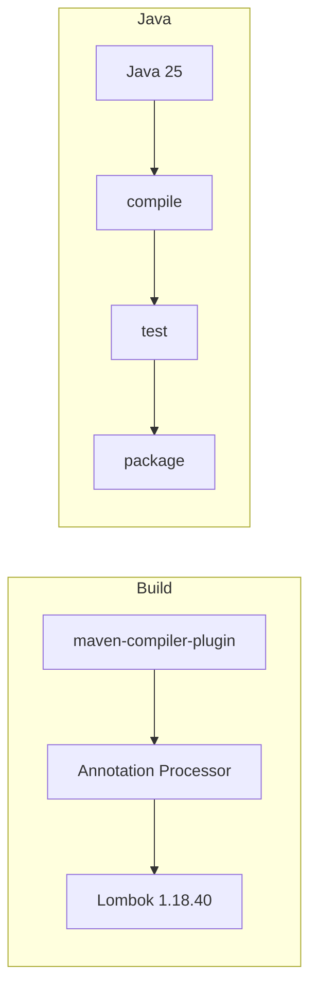

# test-SpringProject Specification

## Project Overview
- **Project Name**: test-SpringProject
- **Group ID**: wo1261931780
- **Artifact ID**: testSpringProject
- **Version**: 0.0.1-SNAPSHOT
- **Description**: junw project - Comprehensive Spring Boot demo project

## Technology Stack

```mermaid
graph TB
    subgraph Core
        SB[Spring Boot 3.4.4] --> WEB[Spring Boot Web]
        SB --> DATA[Spring Boot Data JDBC]
        SB --> CACHE[Spring Boot Cache]
        SB --> ACTUATOR[Spring Boot Actuator]
    end
    
    subgraph Databases
        DATA --> JDBC[JDBC Starter]
        JDBC --> DRUID[Druid Connection Pool]
        JDBC --> HIKARI[HikariCP]
        DATA --> REDIS[Spring Data Redis]
        DATA --> MYSQL[MySQL Connector]
    end
    
    subgraph ORM
        DATA --> MYBATIS[MyBatis-Plus 3.5.7]
        MYBATIS --> PAGING[PageHelper]
        MYBATIS --> DYNAMIC[Dynamic Datasource]
        MYBATIS --> GENERATOR[MyBatis-Plus Generator]
    end
    
    subgraph Messaging
        SB --> AMQP[Spring AMQP]
        AMQP --> RABBIT[RabbitMQ]
        SB --> KAFKA[Spring Kafka]
        KAFKA --> KAFKA_CLIENT[Kafka Clients]
    end
    
    subgraph Web
        WEB --> THYMELEAF[Thymeleaf]
        WEB --> WEBSERVICES[Web Services]
        WEB --> WEBFLUX[WebFlux]
        WEB --> JERSEY[Jersey Client]
    end
    
    subgraph Security
        SB --> SECURITY[Spring Security]
    end
    
    subgraph Utils
        SB --> LOMBOK[Lombok 1.18.40]
        SB --> JACKSON[Jackson]
        SB --> FASTJSON[Fastjson2]
        SB --> HUTOOL[Hutool]
        SB --> COMMONS[Apache Commons]
        SB --> GUAVA[Guava]
    end
    
    subgraph Excel
        MYBATIS --> POI[Apache POI]
        MYBATIS --> FASTEXCEL[FastExcel]
    end
```



## Build Configuration



## Dependency Versions

| Category | Dependency | Version |
|----------|------------|---------|
| Framework | Spring Boot | 3.4.4 |
| Java | Java | 25 |
| ORM | MyBatis-Plus | 3.5.7 |
| Database | MySQL Connector | 8.0.33 |
| Connection Pool | HikariCP | 6.3.0 |
| Redis | Jedis | 6.0.0 |
| Messaging | Spring Kafka | 3.2.3 |
| Utils | Lombok | 1.18.40 |
| Utils | Hutool | 5.8.37 |
| Utils | Fastjson2 | 2.0.57 |

## Build Commands

```bash
# Compile
mvn compile -DskipTests

# Package
mvn package -DskipTests

# Clean
mvn clean
```

## Notes
- Spring Boot dependencies pinned to 3.4.4 (parent version)
- Removed non-existent mybatis-plus-boot3-starter artifact
- Disabled spring-releases/spring-milestones repositories due to 401 auth issues
- Using nexus-aliyun mirror for dependency resolution
